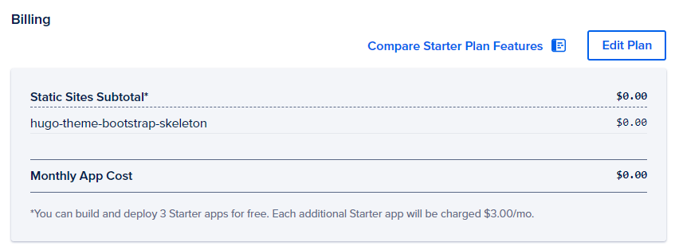

+++
# type = "docs"
title = "Deploy on DigitalOcean App Platform"
linkTitle = "DigitalOcean App Platform"
date = 2024-01-21T15:00:19+08:00
description = "A detailed guide about how to host your static sites on DigitalOcean app platform via using Docker image."
featured = false
draft = false
comment = true
toc = true
pinned = false
carousel = false
categories = [
  "Deployment"
]
tags = [
  "DigitalOcean",
  "Docker",
  "Dockerfile",
  "Buildpack"
]
series = [
  "Docs"
]
images = []
#[funding]
+++

## Requirements

- DigitalOcean Account

## Create Dockerfile

Create the `Dockerfile` on your site root.

> Our [starter template](https://github.com/razonyang/hugo-theme-bootstrap-skeleton) already includes the `Dockerfile`.

```dockerfile
###############
# Build Stage #
###############
FROM hugomods/hugo:exts as builder

COPY . /src

ENV HUGO_ENV=production

# Base URL
ARG HUGO_BASEURL=
ENV HUGO_BASEURL=${HUGO_BASEURL}

# Module Proxy
ARG HUGO_MODULE_PROXY=
ENV HUGO_MODULE_PROXY=${HUGO_MODULE_PROXY}

# NPM mirrors, such as https://registry.npmmirror.com
ARG NPM_CONFIG_REGISTRY=
ENV NPM_CONFIG_REGISTRY=${NPM_CONFIG_REGISTRY}

# Install dependencies
RUN npm ci

# Build site
RUN hugo --minify --gc --enableGitInfo

# Set the fallback 404 page if defaultContentLanguageInSubdir is enabled, please replace the `en` with your default language code.
# RUN cp ./public/en/404.html ./public/404.html

###############
# Final Stage #
###############
FROM hugomods/hugo:nginx
COPY --from=builder /src/public /site
```

- The `/site` is the output directory of static files, which will be used later.

## Create App

Navigate to _DigitalOcean Dashboard_ -> _Left Panel_ -> _Apps_ -> _Create App_, and then fill up the form as follows.


## Tweak Resources

In this step, we'll need to tweak the resources, since currently DigitalOcean app platform Buildpack unable to detect Hugo sites those configured via [configuration directory](https://gohugo.io/getting-started/configuration/#configuration-directory).


You may see multiple resources as image above shown, you'll need to remove unnecessary resources except the one in type `Dockerfile`.

### Edit Dockerfile Resources

Since the web service isn't non free, so we need to edit the Dockerfile resource to be a static site.

1. Click the `Edit` button on the right of the Dockerfile resource, then you'll be navigated to the resource setting panel.
2. Edit the _Resource Type_ and change it to _Static Site_.
3. Edit the _Output Directory_ and set it as `/site`.


Once done, you will get the above similar settings, now let's click the _Back_ button to check the resources.

If everything goes fine, you should got only one resource, which is in type `Static Site | Dockerfile`.


## Review

Please reviewing the billing section, you won't be charged if you deploy not more than 3 static sites.

> Please note that exceeded transfer usage will be charged, read more on [pricing](https://docs.digitalocean.com/products/app-platform/details/pricing/).



## Deploy

It's time to deploy site by clicking the _Create Resources_ button if everything is OK.

## What's Next?

Once the app was created, it will deploy automatically, you can check the build logs if something go wrong.

You'll able to customize domain after deploying successfully.
