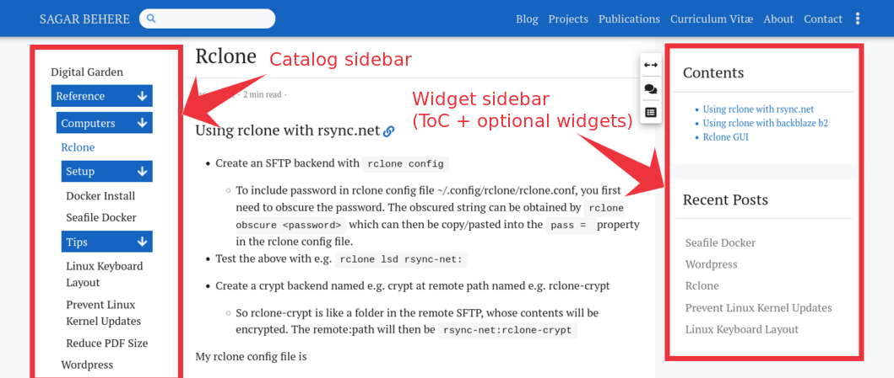
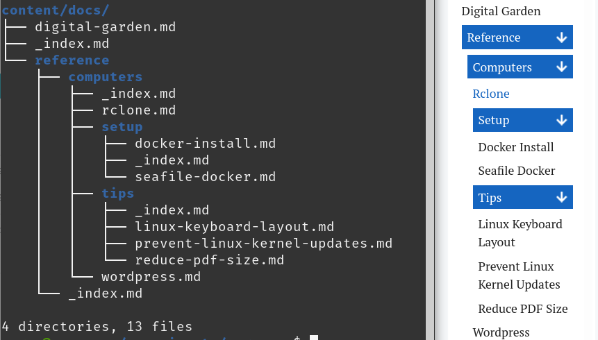

+++
title = "Docs Layout"
description = ""
date = 2022-01-12T10:56:34-08:00
featured = false
draft = false
comment = true
toc = true
reward = true
pinned = false
categories = [
  "Layouts"
]
tags = [
]
series = [
  "Docs"
]
images = []
+++
In this post we explore the `docs` layout that can be used to publish project documentation, a Personal Knowledge Base (PKM), a [Digital Garden](https://maggieappleton.com/garden-history), a [Second Brain](https://fortelabs.co/blog/basboverview/), a [Zettelkasten](https://zenkit.com/en/blog/a-beginners-guide-to-the-zettelkasten-method/), your notes, and more.
<!--more-->
Since v0.63.0, the Hugo Bootstrap Theme supports a new section layout named as the `docs` layout. The `docs` layout is a three-column layout consisting of a "catalog" sidebar in the left column, the main document content in the middle column, and a Table of Contents as well as other configurable widgets in the right column. See the image below for a representative example of the `docs` layout. For a more comprehensive example, look at `content/en/docs` of the `exampleSite` included with this theme.



By default, this layout will show the contents of the `content/docs` folder of your Hugo site. However, it is also possible to use this layout for the contents of any other folder or page by setting the `type` and `layout` variables appropriately in the frontmatter. See Hugo's [frontmatter variables documentation](https://gohugo.io/content-management/front-matter/#front-matter-variables) for more details.

## Left sidebar: Catalog

The catalog sidebar, which is in the left column, shows an automatically generated hierarchy of files/folders in the `docs` section. See the image below for an example of the tree structure of files and folders in `content/docs` (at the left of the image) and the corresponding hierarchy shown in the catalog sidebar (at the right of the image).



Some notable points:

- An `_index.md` file needs to be present in each folder, so that the catalog sidebar shows the hierarchy correctly. Missing `_index.md` files may result in a flatter structure in the catalog sidebar i.e. the hierarchy may not be visible.
- An entry with child pages in the catalog sidebar will typically have two hyperlinks associated with it: The text and the arrows
	- Clicking on the 🡺 / 🡻 arrows of the item will expand/collapse the downstream hierarchy to show/hide the child entries.
	- Clicking on the text of the sidebar entry will show the content of the corresponding `_index.md` file followed by a summary list of the child pages under that item, in the middle column.
- The entries in this sidebar are first sorted by using the `weight` variable in pages` frontmatter in descending order. Subsequently, for pages with the same weight, or if the weight variable is missing, the pages will be sorted alphabetically by title.
- The sidebar is visible on large screens. For medium and smaller screens, the sidebar is hidden by default but can be revealed through the » floating button that appears to the left when the sidebar is hidden.

## Right sidebar: Widgets

This is the sidebar shown in the right column. By default, it contains a Table of Contents widget which shows the ToC of the document in the middle column. 

Additional sidebar widgets from this theme can be added above/below the ToC widget through the use of the hooks in your site's `layouts/partials/hooks/docs/sidebar-begin.html` and `layoutts/partials/hooks/docs/sidebar-end.html`. For example, to add the "Recent posts" and "Featured posts" widgets below the doc, add the following to `layouts/partials/hooks/docs/sidebar-end.html`

```
{{ partial "sidebar/recent-posts" . }}
{{ partial "sidebar/featured-posts" . }}
```

Some notable points:

- The contents of the "Recent posts" sidebar widgets in the `docs` layout will be filtered to only show content from the `docs` section.
- The contents of the right sidebar are "sticky" i.e. they will be shown even as the page scrolls.
