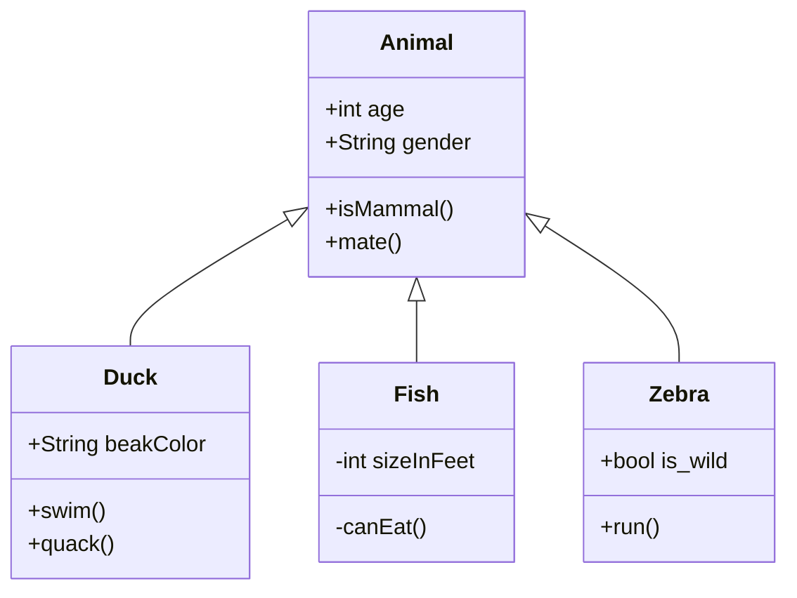

+++
title = "Diagram Guide"
description = "Guide to diagram usage in Markdown"
date = 2021-09-01T11:36:50+08:00
featured = false
draft = false
comment = true
toc = true
reward = true
categories = [
  "Markdown"
]
tags = [
  "Diagram"
]
series = [
  "Docs"
]
authors = ["RazonYang"]
+++

This article offers a sample of basic diagram usage that can be used in Hugo content files.

Please see also [Mermaid](https://mermaid-js.github.io).

<!--more-->

## Usage

### Via Shortcode

```markdown

YOUR DIAGRAM INSTRUCTIONS

```

You can also wrap the shortcode with other shortcodes, such as `text/align-center`.

```markdown
{}

YOUR DIAGRAM INSTRUCTIONS

{}
```

### Mermaid code block

````markdown
```mermaid
YOUR DIAGRAM INSTRUCTIONS
```
````

## Examples

### Flow Chart

```markdown

graph TD
    A[Christmas] -->|Get money| B(Go shopping)
    B --> C{Let me think}
    C -->|One| D[Laptop]
    C -->|Two| E[iPhone]
    C -->|Three| F[fas:fa-car Car]

```

{}

graph TD
    A[Christmas] -->|Get money| B(Go shopping)
    B --> C{Let me think}
    C -->|One| D[Laptop]
    C -->|Two| E[iPhone]
    C -->|Three| F[fas:fa-car Car]

{}

We need to [import the `faCar` solid icon]() first, in order to use the `fas:fa-car` FontAwesome icon.

### Sequence Diagram

```markdown

sequenceDiagram
    Alice->>+John: Hello John, how are you?
    Alice->>+John: John, can you hear me?
    John-->>-Alice: Hi Alice, I can hear you!
    John-->>-Alice: I feel great!

```

{}

sequenceDiagram
    Alice->>+John: Hello John, how are you?
    Alice->>+John: John, can you hear me?
    John-->>-Alice: Hi Alice, I can hear you!
    John-->>-Alice: I feel great!

{}

### Class Diagram

````markdown

````


